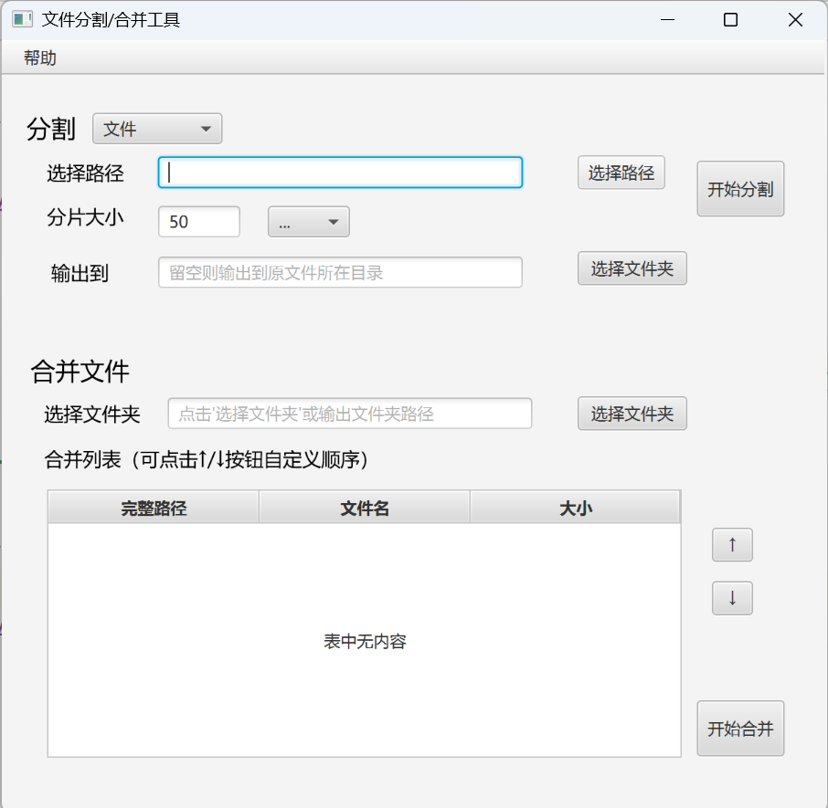

# 文件分割合并工具 (File Split & Merge Tool)

[](https://www.oracle.com/java/)
[](https://openjfx.io/)
[](LICENSE)

一款跨平台的文件分割与合并工具，参考Linux中的`split`和`merge`命令实现相关基础功能。

分割时支持**按字节**（KB/MB/GB）和**按行数**（日志文件）分割，合并时可**自定义分片顺序**，适用于大文件处理、日志分析等场景。

---

## ✨ 功能亮点

- **智能分割**
    - **文件模式**：按 50MB、100MB 等自定义大小分割二进制文件
    - **日志模式**：按 1000 行、5000 行等自定义行数分割文本日志
    - 输出目录必须为空，避免文件污染

- **灵活合并**
    - 自动识别指定文件夹下的 `xxx_01.ext`, `xxx_02.ext` 格式分片
    - **可视化调整**：通过 ↑/↓ 按钮或拖拽调整合并顺序
    - **右键删除**：移除不需要的分片
    - 合并前预览文件列表（完整路径、文件名、大小）

- **专业体验**
    - 进度条实时显示分割/合并进度
    - 操作完成弹窗提示（含示例文件名）
    - **跨平台中文字体内嵌**，Linux 英文版系统完美显示中文
    - “关于”菜单提供软件说明

---

## 🖥️ 截图

| Windows 11界面 | Redhat 7.9界面 |
|----------|----------|
|    |    |

> 💡 *不同平台运行结果以实际结果为准*

---

## ⚙️ 运行环境要求

| 组件 | 版本 | 说明 |
|------|------|------|
| **操作系统** | Windows / macOS / Linux | 全平台64位支持 |
| **Java** | **JDK 8+ ** | 推荐使用JDK8，内置JavaFX |
| **内存** | ≥ 512 MB | 大文件处理建议 ≥ 2GB |

> ⚠️ **重要**：  
> 普通 从OpenJDK 11+ 开始**不内置 JavaFX**！推荐使用 **JDK 8**，或单独安装 JavaFX SDK。

---

## 🚀 快速开始

推荐通过 `JRE`环境 和 下载 `SplitAndCombineFile.jar` 运行

### Windows / MacOS 平台

1. 下载 [最新 Release]()，配置JRE8+环境
2. 终端执行：

  ```bash
  java -jar <SplitAndCombineFile.jar完整路径>
  ```

> 💡 *如果有需要，在Windows平台可以通过 exe4j 等软件将jre和jar包打包成一个可执行文件来一键运行！！*

### Linux 平台

1. 下载 [最新 Release]()，配置JRE8+环境
2. 配置 X Server 环境（针对终端服务器，否则跳过这步）

  ```bash
  export DISPLAY=<客户端IP>:0.0
  ```

3. 终端执行：

  ```bash
  java -Dprism.order=sw -jar <SplitAndCombineFile.jar完整路径>
  ```